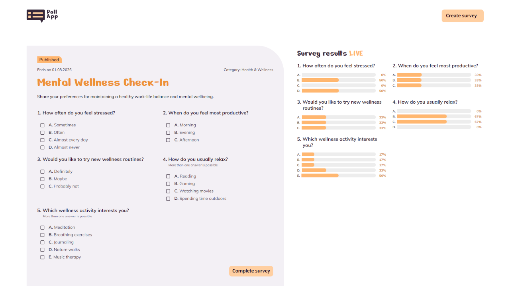
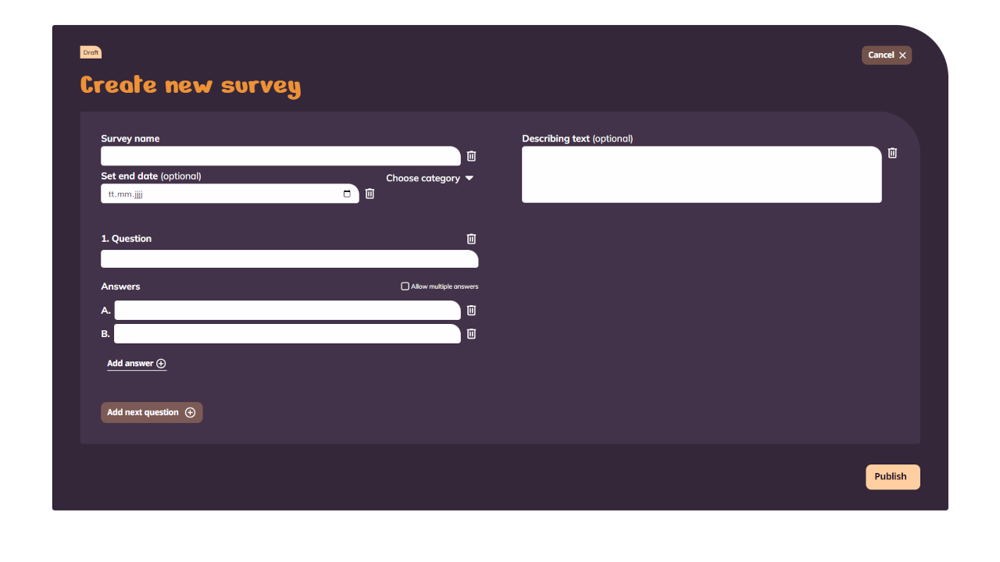

# Poll App

A responsive survey application built with **Angular**, **TypeScript**, **SCSS**, and **Supabase**.

The project allows users to create surveys, participate in active polls, and follow results as answers are selected. It focuses on reusable Angular components, typed reactive forms, and a clear separation between UI, application logic, and database access.

---

## Live Demo

[View PollApp](https://pollapp.dominik-troendle.de)

---

## About the Project

Poll App provides a central overview of active and expired surveys. Users can filter surveys by category, open an active survey to vote, and create new surveys with multiple questions and answer options.

Survey data, questions, answer options, responses, and submitted answers are stored in related Supabase tables. Draft selections are included in the live result display before they are committed to the database.

---

## Features

- Overview of active and expired surveys
- Highlighted surveys that are ending soon
- Filtering by survey status and category
- Single-choice and multiple-choice questions
- Live result visualization while answering a survey
- Persistent survey responses and answers with Supabase
- Dynamic survey creation with questions and answer options
- Typed reactive forms with validation
- Responsive layouts for mobile and desktop
- Route-based lazy loading of standalone Angular components

---

## Tech Stack

- **Angular 21** - standalone components, signals, routing, and reactive forms
- **TypeScript** - typed application logic and data models
- **SCSS** - component styles, reusable variables, mixins, and breakpoints
- **Supabase** - relational data storage and persistence
- **Vitest** - unit test runner
- **Prettier** - automated code formatting
- **GitHub Actions** - formatting and production-build checks

---

## Getting Started

### Prerequisites

- Node.js 24
- npm
- A Supabase project with the required database tables and policies

### Installation

```bash
npm install
```

### Run the development server

```bash
npm start
```

Open `http://localhost:4200/` in your browser. The application reloads automatically when source files change.

### Create a production build

```bash
npm run build
```

### Run unit tests

```bash
npm test
```

### Check formatting

```bash
npm run format:check
```

### Format the project

```bash
npm run format
```

---

## Project Structure

```text
src/
├── app/
│   ├── create-survey/   # Survey creation and dynamic reactive form fields
│   ├── home/            # Hero, ending-soon section, and survey overview
│   ├── shared/          # Reusable UI, interfaces, services, and utilities
│   └── survey/          # Survey form, questions, inputs, and live results
├── styles/
│   ├── abstract/        # Variables, mixins, and responsive breakpoints
│   └── base/            # Global font definitions
└── styles.scss          # Global stylesheet entry point

public/
├── fonts/               # Local font files
├── png/                 # Assets
└── svg/                 # Logos, icons, and visual elements
```

---

## Data Model

The application uses related Supabase tables for its survey data:

- `surveys` stores survey metadata such as title, description, category, and end date
- `questions` stores the questions belonging to a survey
- `answer_options` stores the selectable answers for each question
- `survey_responses` represents a completed participation in a survey
- `response_answers` connects a response with its selected answer options

---

## Key Concepts

- **Standalone Angular components** organized by feature
- **Typed reactive forms** with nested `FormGroup` and `FormArray` structures
- **Signals and computed state** for surveys, selections, and responsive UI state
- **Parent-child communication** through signal inputs and outputs
- **Relational data loading and persistence** through a dedicated Supabase service
- **Draft result calculation** without writing unfinished responses to the database
- **Lazy-loaded routes** for the home, survey, and create-survey views
- **Continuous integration** for formatting and build verification on pushes and pull requests

---

## Author

Dominik Tröndle,
Frontend Developer based in Munich

---

## Preview




